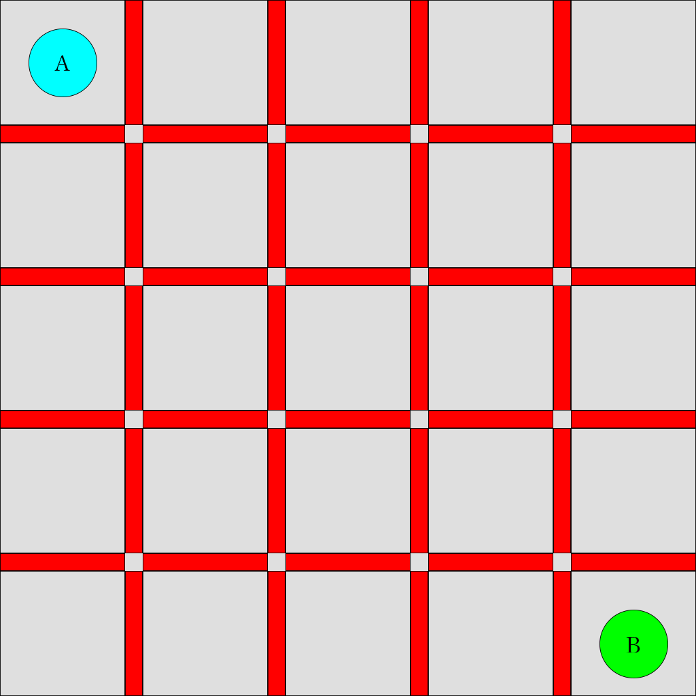
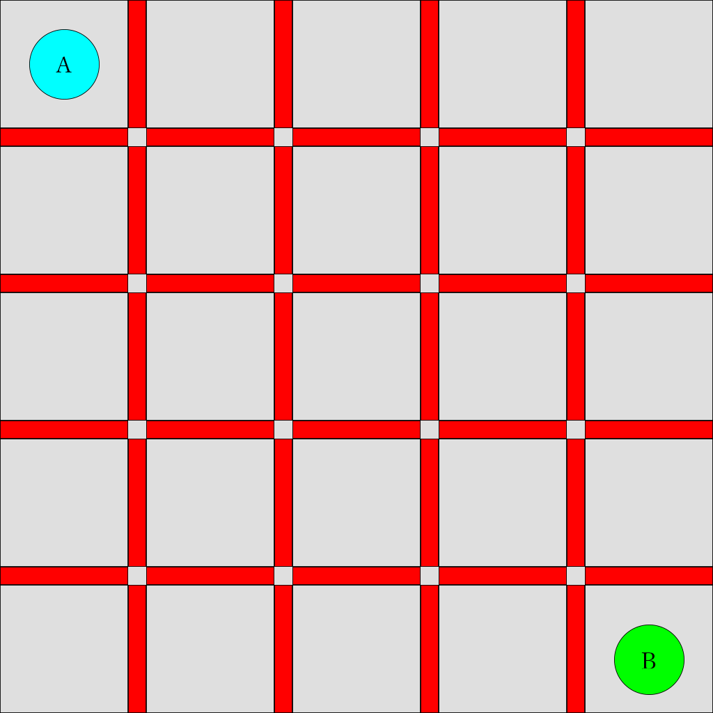

# Colosseum Survival!

<p align="center">
  
</p>

## Note

We currently only support $`2`$-player version of this game. 

## Simulate a game

```bash
python simulator.py -h       
usage: simulator.py [-h] [--player_1 PLAYER_1] [--player_2 PLAYER_2]
                    [--board_size BOARD_SIZE] [--display]
                    [--display_delay DISPLAY_DELAY]

optional arguments:
  -h, --help            show this help message and exit
  --player_1 PLAYER_1
  --player_2 PLAYER_2
  --board_size BOARD_SIZE
  --display
  --display_delay DISPLAY_DELAY
```

## Write your own agents

We have provided an example agent implementation in `agents.RandomAgent`. After implementing your own in the agents directory, register your agent using the decorator `@register_agent`. You can also play this game with human players using `agents.HumanAgent`.

## Gameboard

<p align="center">
  
</p>

## Game Setting
On an $`M \times M`$ chess board, $`n`$ players are randomly distributed on the board with one player occupying one block.

## Game Moving
In each iteration, one player moves at most $`K`$ steps (between $`0`$ and $`K`$) in either horizontal or vertical direction, and must put a barrier around him or her in one of the 4 directions except the boarders of the chess board. The players move in a round-robin way.

### Note: 
 - Each player cannot go into other player's place or put barriers in areas that already have barriers.
 - Currently the maximal number of steps is set to $`K = (M + 1) // 2`$.

## Game Ending
The game ends when each player is separated in a closed zone by the barriers and boundaries. The final score for each player will be the number of blocks in that zone.
```math
S_i = \#\text{Blocks of Zone}_i
```

## Goal
Each player should maximize the final score of itself, i.e., the number of blocks in his zone in the endgame.

## Example Gameplay
Here we show a gameplay describing a $`2`$-player game on a $`5\times 5`$ chessboard. Each player can move at most $`3`$ steps in each round.

<p align="center">
  
</p>

The final score is $`A:B = 15:10`$. So A wins the game.
